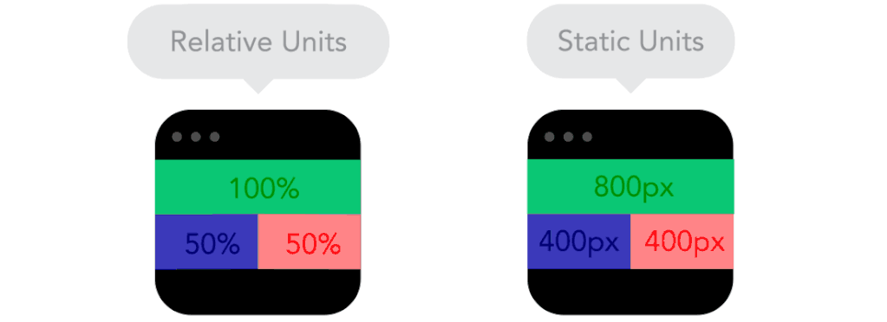

# Frontend Mentor - Intro Component with Sign Up Form

This is a solution to the [Intro component with sign up form challenge on Frontend Mentor](https://www.frontendmentor.io/challenges/intro-component-with-signup-form-5cf91bd49edda32581d28fd1). Frontend Mentor challenges help you improve your coding skills by building realistic projects. 

## Table of contents

- [Overview](#overview)
  - [The challenge](#the-challenge)
  - [Screenshot](#screenshot)
  - [Links](#links)
- [My process](#my-process)
  - [Built with](#built-with)
  - [What I learned](#what-i-learned)
  - [Continued development](#continued-development)
  - [Useful resources](#useful-resources)
- [Author](#author)


## Overview

Hello! Welcome to my second solo Javascript project. I decided to try the "registration form" design and try my hand at practicing input validation. It's funny, the Frontend Mentor website lists this challenge as "Newbie," and their [Password Generator app](https://www.frontendmentor.io/challenges/password-generator-app-Mr8CLycqjh) exercise as "Intermediate." With this labelling, I foolishly assumed I would be somewhat quicker at completing this project. Once again, pretty cheeky of me to think as someone who knows only about a crumb of Javascript. 

My main goal of this project was to continue building a solid foundational understanding of Vanilla Javascript before moving onto learning React.jS. I also wanted to gain a better understanding with responsive breakpoints, and creating the mobile-friendly display. I recalled learning the ```@media``` query on freecodecamp, but I honestly couldn't tell you exactly how it worked or why it worked the way it did. With a majority of the world spending more time on their mobile devices, having a website that fails to be mobile-friendly can completely ruin any chances for a business to have successful connections with their clients, new and old. Finally, I wanted to properly implement accessibility features, such as utilizing ```aria labels```. Since this exercise involves building a Registration Page of sorts, I think it'd be a good idea to make sure those with disabilites can access the page to ensure the figurative client base grows. 

The initial deadline for completion I gave myself was 5 days, not including breaks. In terms of how many hours I spent on my code, I finished work on the HTML and CSS files in about 6 hours and 15 minutes. The Javascript portion took a majority of my time at 9 hours and 37 minutes. Overall time spent on coe from start to finish was 9 hours and 52 minutes. Not bad! Good news is that I definitely took a lot less time than the Password Generator App, bad news is that I still can't quite accurately judge how long it will take me to build a product based on looking at the design. Will have to keep building and collect more data about myself I suppose! 

### The challenge

Users should be able to:

- View the optimal layout for the site depending on their device's screen size
- See hover states for all interactive elements on the page
- Receive an error message when the `form` is submitted if:
  - Any `input` field is empty. The message for this error should say *"[Field Name] cannot be empty"*
  - The email address is not formatted correctly (i.e. a correct email address should have this structure: `name@host.tld`). The message for this error should say *"Looks like this is not an email"*

### Screenshots

#### Scrimba Intro Component: Desktop Design

#### Scrimba Intro Component: Mobile Design

#### Scrimba Intro Component: Active States

#### Progress Screenshot: Completed HTML and CSS Styling


### Links

- Live Site URL: [Nicole Fortin_Intro Component with Sign Up Form](https://lilbelpepper.github.io/NF_Intro_Component_with_Sign_Up_Form/)

## My process

### Built with

- Semantic HTML5 markup
- CSS custom properties
- Flexbox
- Vanilla Javascript
- [Styled Components](https://styled-components.com/) - For styles


### What I learned

Despite this project being a "step down" in Frontend Mentor's difficulty rating, I still learned quite a lot! In the [Password Generator app I built](https://github.com/LilBelPepper/NF_Password_Generator_App), I was able to use labels with the input checkbox elements to allow Users to customize their randomly generated password. I learned there that labels add accessibility value as the label will be read out for those who use screen readers. Label elements also increase the hit box area of the checkbox input, which benefits Users who have difficulty with clicking on smaller regions. However with this design, there seemed to be no visible use of common label elements. Thankfully with the help of a little research, I learned from mdm web docs that "aria-labels can be used in cases where text that could label the element is NOT visible." 

Within the same vein of aria-tags and aria-labels I tried to learn about aria-roles. I was curious about them as I saw aria-roles most often when inspecting various websites during my day-to-day web surfing. Unfortunately, I quickly got overwhelmed by the amount of options, what I can and can't label, what is suggested and what is not suggested, it became confusing fairly quickly. (Though I will admit I was reading up on this new information at around midnight, so I probably just had a tough time understanding due to lack of sleep.) I'll have to revisit research of aria-tags, labels, and roles during my next project.

With the inclusion of a mobile-friendly interface came the use of media query breakpoints! Turns out that media queries are quite straightforward in regards to what you interact with on the CSS styling sheet. Of course I learned that you only change what elements are not displaying correctly when using the media query, such as an image that is overflowing from its container. In terms of sizing units, it seems that the best practice for mobile displays is to use ```rem``` units as opposed to pixels. From what I understand, ```rem``` units are relative to the font size of the HTML element. So, if I have my font setting set to 16px, 1rem unit is equal to 16px. ```rem``` units are best used for website responsiveness in comparison to static pixels, as they're easier to resize according to a User's viewing device. ```rem``` units can be a little tricky to work with, I had to use a rem-to-pixel converter to make sure I was getting the right sizes. In the future I might try implementing ```rem``` units right off the bat instead of using them only in the mobile-friendly breakpoint. 

#### Responsive Web Design Gif by Designer Sandjis Ruluks


Another thing I've learned in regards to creating a mobile-friendly display is the process of Mobile-First Design. This basically is as it sounds, you style your HTML document starting with the mobile-display first and then work your way up to the larger displays such as tablets and then desktops. I imagine working on a smaller device and then scaling upwards is much easier than going the traditional route of developing the desktop version first. The most I struggled with was trying to have the input elements not overflow out of their containers, thus creating a horizontal scroll bar that is not included in the mobile design. I'll have to test out the Mobile-First approach next time to see if it really makes a difference.

My most favorite thing (and also the trickiest) was the actual form validation portion of the project. I had simple path of validating the entire form utilizing the ```submit``` button, but then I thought about how some registration forms already validate a User's input (or lack thereof) when they click off of the input element. This is where I learned about the ```.addEventListener("blur")``` function!

```javascript
function showValidation(elem, msg) {
    const inputErrorMsg = elem.parentNode.querySelector(".inputError")
    inputErrorMsg.innerText = msg
}

const inputElements = document.querySelectorAll("input");
for (let i = 0; i < inputElements.length; i++) {
    const input = inputElements[i];
    const inputErrorStyle = document.querySelectorAll("input")

    // List of messages to appear with their appropriate input fields
    const msg = ["First Name cannot be empty", "Last Name cannot be empty", "Looks like this is not an email", "Password cannot be empty"]

    const addErrorContainer = document.querySelectorAll(".inputContainer")
    const errorIcon = document.createElement("img")
    errorIcon.src = "./images/icon-error.svg"
    errorIcon.className = "errorIcon"
    errorIcon.alt = "Error Icon"


    // Validate on blur, or validate when user clicks away from element
    input.addEventListener("blur", function(e) {
        e.target.checkValidity();
    })
```

The ```.addEventListener("blur")``` function is used when the User essentially brings their "focus" away from the element, or in other words, when the User clicks out of the input field. Again, this part of the code is not really mandatory, as form validation can be done the simple way of using the ```submit``` button. But sometimes it's just fun to try something different every once in a while!


**My most important discovery however, is how *completely unsecure* this simple Registration Form is.** Obviously I am not creating an ```https``` website and therefore it's not considered secure, that much is a given. However I found that upon clicking the "submit" button, the text that the User would put in the input fields are ammended to the URL in plaintext. 


This is wholly unsafe, especially with the password value being shown in plaintext in the URL. Should a User be surfing the web and logging in on a public network such as the cafe or the airport, a malicious attacker could easily view the URL utilizing a packet sniffer. The attacker wouldn't even need to log in via the log in screen, they could simply copy and paste the end of the URL and be directed to the User's account that way. This could easily lead to an Administrator's account being stolen as well. 

I still have a long way to go, but I'm already on the hunt to learn *secure* coding development right off the bat. The first resource I can think of off the top of my head to go poke around in is [OWASP](https://owasp.org/). They have a "[Secure Coding Practices-Refernce Guide](https://owasp.org/www-project-secure-coding-practices-quick-reference-guide/)" I can look at to give me an idea of what I'm in for. 


### Continued development

In terms of this project, the one known issue I have is that when utilizing a "space" character in the password field, it still renders as "not a valid password" as it should, but according to the active design states, there shouldn't be a password dot placeholder when when the input is empty, or has a "space" character inside. I might just be a bit nitpicky at this point, but I believe accuracy is an important trait for a developer. I'll have to see if there is a simple way to remedy this in the future.

In the next project I may finally start focusing on using React.jS and it's resources. I'm a bit hesitant to continue the [React course with Scrimba](https://scrimba.com/learn/learnreact) as I find I'm getting a bit bored with tutorials now, but I also want to get a basic understanding of React before trying to implement it in my next project. 


### Useful resources

- [W3 Schools Javascript Form Validation](https://jsfiddle.net/Gpnn6/4/) - Heavily referenced this code for my Javascript! Instead of validating on submit, this code helped me validate on "blur".
- [Javascript LET variable array](https://stackoverflow.com/questions/58914422/can-a-let-statement-define-2-things) - This one might be a no-brainer to the experts out there, but this stackoverflow post helped me realize I could put the error messages into an array with one variable name, and thus call them using a ```for (let i)``` loop which I thought was really cool


## Author

- linkedIn - [Nicole Fortin](https://www.linkedin.com/in/nicole-fortin-3530b9211/)
- Frontend Mentor - [@LilBelPepper](https://www.frontendmentor.io/profile/LilBelPepper)

